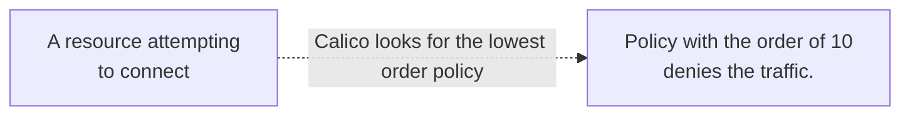
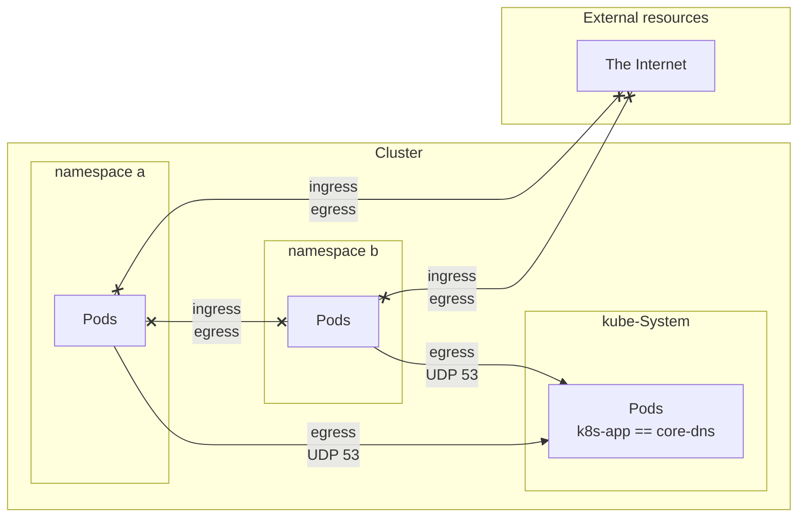
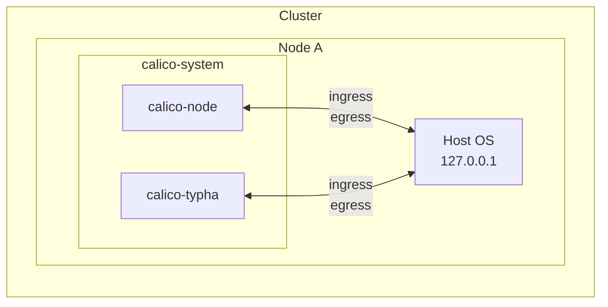
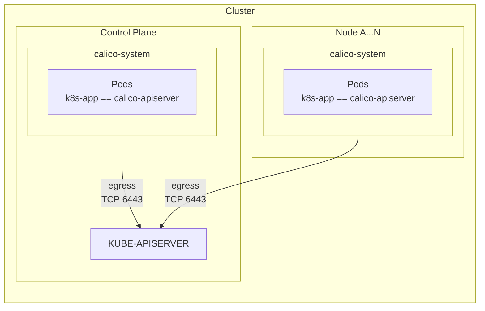
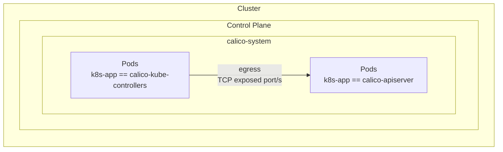
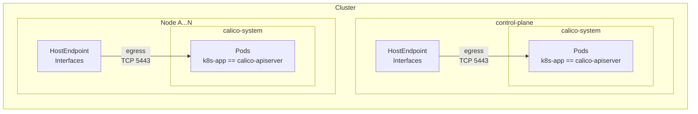
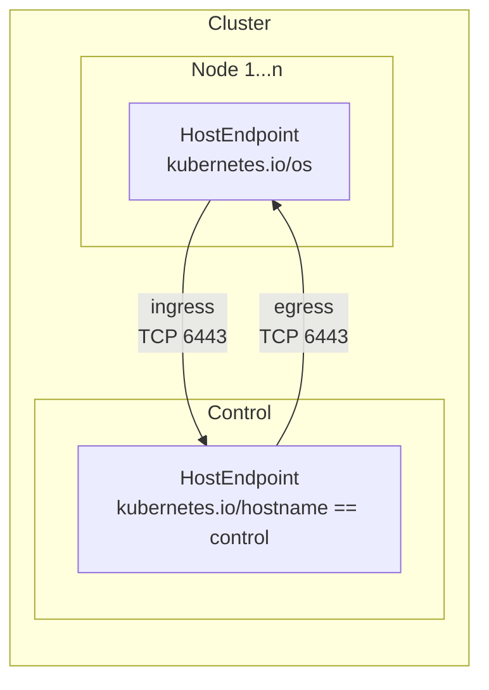
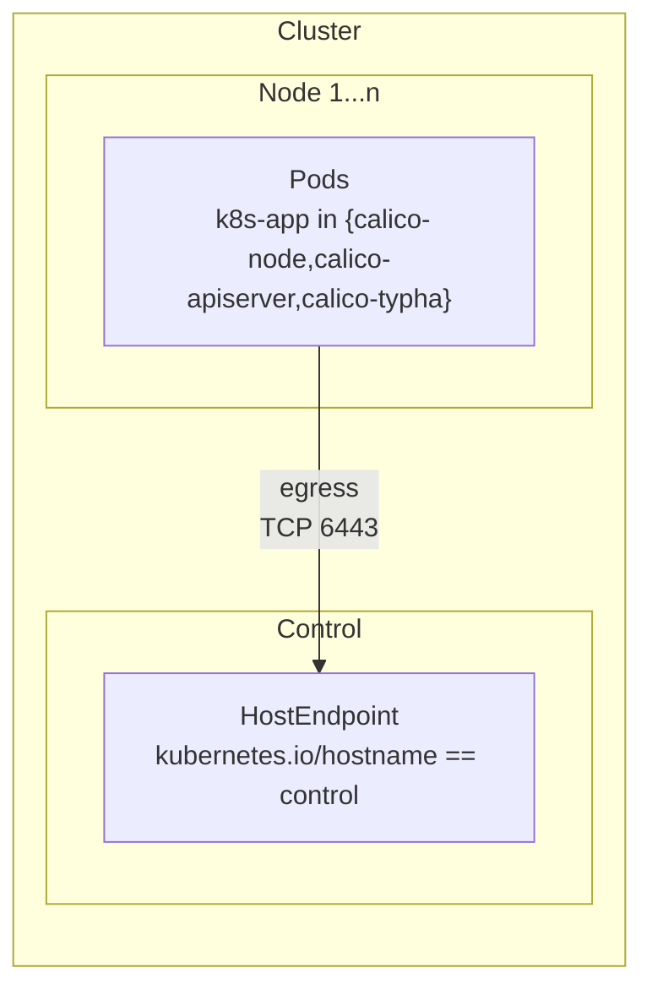
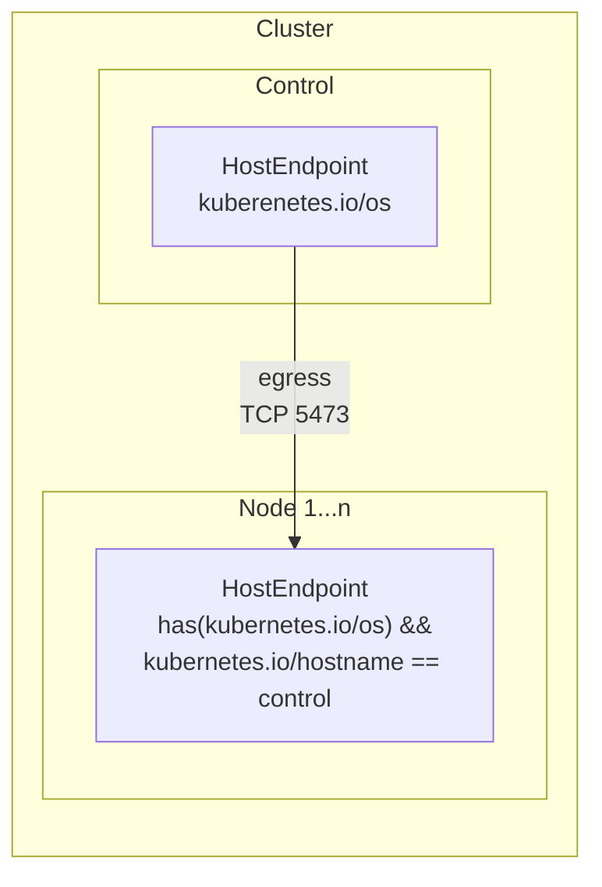
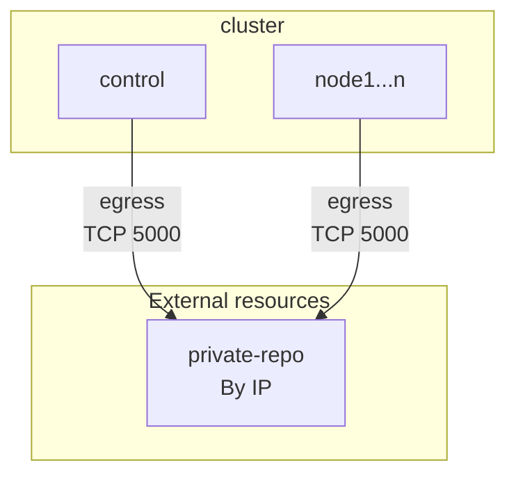

# Policy design

Kubernetes provides a framework for defining and applying policies to your cluster, but it is up to the administrator to create and enforce those policies. However, on its own, Kubernetes doesn't enforce these policies, and it delegates this to the container networking interface (CNI) plugin. 

One of the key default behaviors in Kubernetes is that all pods are allowed to communicate with each other by default. This means that if a pod is running a vulnerable application, other pods in the same cluster may also be at risk. To mitigate this risk, it is recommended to create network policies that restrict the traffic between pods based on their labels. However, this behavior changes to a default deny the moment that you add a policy to your cluster. When a network policy is added to a Kubernetes cluster, it overrides the default allow-all behavior and enforces the rules (with the help of your CNI) defined in the policy. This means that if a pod tries to communicate with another pod that is not explicitly allowed by the policy, the communication will be denied.

```
apiVersion: networking.k8s.io/v1
kind: NetworkPolicy
```

```
apiVersion: projectcalico.org/v3
kind: NetworkPolicy
```

```
apiVersion: projectcalico.org/v3
kind: GlobalNetworkPolicy
```

## Policy precedence

In Calico, policy priority is determined based on the order assigned to each policy, with lower order policies taking precedence over higher order policies. This means that if you have two policies in a Calico-enabled Kubernetes cluster, one that denies traffic with a order of 10 and the other that allows traffic with a order of 20, the traffic will be denied since the lower order policy takes precedence over the higher order policy.

The following illustration is the behavior that will take place in such a scenario:


In Calico, you can specify the order by adding the `order` field to the policy's `spec` section. For example:
```
spec:
  order: 1
```

#### Kubernetes policy precedence
When you create a Kubernetes NetworkPolicy (KNP) and a Calico policy in the same cluster, Calico will automatically assign the KNP a default order number of `1000` since Kubernetes policy resources do not provide an explicit way to set the order of policy evaluation and enforcement.

If you want the KNP to be evaluated and enforced before any Calico policies, you will need to set the order number of your Calico policy to a value higher than `1000`. For example, you can set the order number of your Calico policy to `1001` or higher to ensure that it is evaluated and enforced after the KNP.

> **Note:** It is important to carefully manage policy order in Calico to ensure that your policies are evaluated and enforced correctly in your Kubernetes cluster.


#### Calico policy precedence
You might now be wondering what is the order number for a Calico policy when it is not defined. In such a case Calico policies will automatically have an order greater than `1000`.

#### The tie breaker rule
In a scenario where you have multiple Calico policies without an order number or with the same order number, Calico policy engine will use their name as a tiebreaker to determine the order of policy evaluation and enforcement.

For example, if you have two un-ordered policies named `alpha` and `zulu`, the policy engine will first evaluate and enforce the policy named `alpha` and then the policy named `zulu`.

#### The Log rule
One thing worth mentioning is a Log policy and its affect on the behavior that we explored. A log policy changes the 
```
spec:
  order: 1
```

## Preventing a lockout
As a best practice whenever you are trying to experiment with policies in any environment it is best to implement a `safe-mode` strategy by first explicitly permitting the traffic and then writing your deny rules. This helps to eliminate the chance of accidentally locking yourself out of a cluster if a misconfigured policy is applied.

> **Note:** If you following this tutorial on powershell use the https://github.com/frozenprocess/Tigera-Presentations/tree/master/2023-03-30.container-and-Kubernetes-security-policy-design/04.best-practices-for-securing-a-Kubernetes-environment

Use the following command to explicitly allow every traffic in and out of your cluster:
```
kubectl create -f -<<EOF
apiVersion: projectcalico.org/v3
kind: GlobalNetworkPolicy
metadata:
  name: final-allow-everything 
spec:
  order: 100001
  ingress:
  - action: Allow
  egress:
  - action: Allow
EOF
```
> **Note:** Policy files can be found in [this](https://github.com/frozenprocess/Tigera-Presentations/tree/master/2023-03-30.container-and-Kubernetes-security-policy-design/04.best-practices-for-securing-a-Kubernetes-environment) directory.

It is worth mentioning that to prevent disruption due to a misconfigured policy, Calico implements a fail-safe, which is a policy with a list of essential ports and services that are required for your cluster to function.

Here is the list of ports that are included in the failsafe rule:
| Port   | Protocol | Direction           |              Purpose                           |
|--------|----------|---------------------|------------------------------------------------|
|   22   |   TCP    |  Inbound            |             SSH access                         |
|   53   |   UDP    |  Outbound           |             DNS queries                        |
|   67   |   UDP    |  Outbound           |             DHCP access                        |
|   68   |   UDP    |  Inbound            |             DHCP access                        |
|   179  |   TCP    |  Inbound & Outbound |             BGP access (Calico networking)     |
|   2379 |   TCP    |  Inbound & Outbound |             etcd access                        |
|   2380 |   TCP    |  Inbound & Outbound |             etcd access                        |
|   6443 |   TCP    |  Inbound & Outbound |             Kubernetes API server access       |
|   6666 |   TCP    |  Inbound & Outbound |             etcd self-hosted service access    |
|   6667 |   TCP    |  Inbound & Outbound |             etcd self-hosted service access    |


## Default egress policy for namespaced resources

In Calico, a Workload Endpoint (WEP) is a virtual interface that is automatically assigned to VMs, containers, or other workloads running in a Kubernetes cluster. These interfaces are used to enforce network policies and to route traffic from or to your workloads. This allows the traffic originating from your workloads to be easily manipulated by Kubernetes Network Policies (KNP) or Calico policy resources. Calico also provides a host endpoint (HEP) resource that can be used to enforce a particular network behavior on host networking cards and processes that are running on the host OS.

> **Note:** The default deny in the tutorial is crafted with the assumption that you will be enabling host endpoints policies, which allow for more fine-grained control over network traffic. If you are not interested in using host endpoints policies, you can use <a href="https://docs.tigera.io/calico/latest/network-policy/get-started/kubernetes-default-deny">this</a> example. 


Use the following command to restrict workload resources from reaching the internet:
```
kubectl create -f -<<EOF
apiVersion: projectcalico.org/v3
kind: GlobalNetworkPolicy
metadata:
  name: deny-app-policy
spec:
  order: 1001
  namespaceSelector: has(projectcalico.org/name)
  types:
  - Ingress
  - Egress
  egress:
  - action: Allow
    protocol: UDP
    destination:
      selector: 'k8s-app == "kube-dns"'
      ports:
      - 53
EOF
```

Traffic 


The following image is an illustration for `deny-app-policy`:


## Workloads to Host OS


Use the following command to allow containers communicating with the localhost:
```
kubectl create -f -<<EOF
apiVersion: projectcalico.org/v3
kind: GlobalNetworkPolicy
metadata:
  name: allow-containers-access-to-localhost 
spec:
  order: 1000
  selector: has(kubernetes.io/os)
  ingress:
  - action: Allow
    destination:
      nets:
      - 127.0.0.0/8
  egress:
  - action: Allow
    destination:
      nets:
      - 127.0.0.0/8
EOF
```

The following image is an illustration for `allow-containers-access-to-localhost`:


## Workloads to Kubernetes components

Calico API server talks to the Kubernetes API server since api server is protected by hostendpoint policies global() is required
```
apiVersion: projectcalico.org/v3
kind: NetworkPolicy
metadata:
  name: calico-apiserver-to-kapi
  namespace: calico-apiserver
spec:
  order: 1000
  selector: 'k8s-app == "calico-apiserver"'
  egress:
  - action: Allow
    protocol: TCP
    destination:
      selector: has(kubernetes.io/os)
      namespaceSelector: global()
      ports:
      - 6443
EOF
```

The following image is an illustration for `calico-apiserver-to-kapi`:


## Workloads in the same namespace

calico-Kubernetes-controller connects to api-server on port 5443
```
kubectl create -f -<<EOF
apiVersion: projectcalico.org/v3
kind: NetworkPolicy
metadata:
  name: calico-kube-controllers-to-apiserver
  namespace: calico-system
spec:
  order: 1000
  selector: 'k8s-app == "calico-kube-controllers"'
  egress:
  - action: Allow
    protocol: TCP
    destination:
      selector: k8s-app == "calico-apiserver"
EOF
```



## calico-Kubernetes-controller

```
kubectl create -f -<<EOF
apiVersion: projectcalico.org/v3
kind: GlobalNetworkPolicy
metadata:
  name: calico-components-to-apiserver
spec:
  order: 1000
  selector: has(kubernetes.io/os)
  egress:
  - action: Allow
    protocol: TCP
    destination:
      selector: 'k8s-app == "calico-apiserver"'
      ports:
      - 5443
EOF
```

The following image is an illustration for `calico-components-to-apiserver`:


## 

```
kubectl create -f -<<EOF
apiVersion: projectcalico.org/v3
kind: GlobalNetworkPolicy
metadata:
  name: worker-nodes-to-kapi
spec:
  order: 1000
  selector: has(kubernetes.io/os)
  ingress:
  - action: Allow
    protocol: TCP
    destination:
      selector: has(kubernetes.io/os) && kubernetes.io/hostname == "control"
      ports:
      - 6443
  # kube-schudler or other component talking to the local loopback
  egress:
  - action: Allow
    protocol: TCP
    destination:
      selector: has(kubernetes.io/os) && kubernetes.io/hostname == "control"
      ports:
      - 6443
EOF
```

The following image is an illustration for `worker-nodes-to-kapi` policy:



## 

```
apiVersion: projectcalico.org/v3  
kind: GlobalNetworkPolicy
metadata:
  name: srcnated-to-kapi
spec:
  order: 1000
  selector: has(k8s-app) && k8s-app in {"calico-node","calico-apiserver","calico-typha"}
  egress:
  - action: Allow
    protocol: TCP
    destination:
      selector: has(kubernetes.io/os) && kubernetes.io/hostname == "control"
      ports:
      - 6443
```

The following image is an illustration for `srcnated-to-kapi` policy:


## 


Calico typha rules
```
kubectl create -f -<<EOF
apiVersion: projectcalico.org/v3
kind: GlobalNetworkPolicy
metadata:
  name: worker-nodes-to-typha
spec:
  order: 1000
  selector: has(kubernetes.io/os)
  ingress:
  - action: Allow
    protocol: TCP
    destination:
      selector: has(kubernetes.io/os) && kubernetes.io/hostname == "control"
      ports:
      - 5473
  # kube-schudler or other component talking to the local loopback
  egress:
  - action: Allow
    protocol: TCP
    destination:
      selector: has(kubernetes.io/os) && kubernetes.io/hostname == "control"
      ports:
      - 5473
EOF
```

The following image is an illustration for `worker-nodes-to-typha` policy:


Private registry
===

```
kubectl create -f -<<EOF
apiVersion: projectcalico.org/v3
kind: GlobalNetworkPolicy
metadata:
  name: private-registry-policy
spec:
  order: 1001
  egress:
  - action: Allow
    protocol: TCP
    destination:
      nets:
      - $REGISTRY_IP/32
      ports:
      - 5000
EOF
```

The following image is an illustration for `private-registry-policy` policy:



Enabling HostEndpoint
===

Use the following command to enable host endpoint policies.
```bash
kubectl patch kubecontrollersconfiguration default --type=merge --patch='{"spec": {"controllers": {"node": {"hostEndpoint": {"autoCreate": "Enabled"}}}}}'
```

If you are following the tutorial on Windows use the following command in PowerShell: 
```powershell
kubectl patch kubecontrollersconfiguration default --type=merge --patch='{\"spec\": {\"controllers\": {\"node\": {\"hostEndpoint\": {\"autoCreate\": \"Enabled\"}}}}}'
```

Default deny
===

Use the following command to drop every communication that has not been explicitly allowed:
```
kubectl delete -f https://raw.githubusercontent.com/frozenprocess/Tigera-Presentations/master/2023-03-30.container-and-Kubernetes-security-policy-design/04.best-practices-for-securing-a-Kubernetes-environment/00.allow-everything.yaml
```

Next step
===
In the next tutorial we are going to briefly look at [monitoring](../05.monitoring/readme.md).
