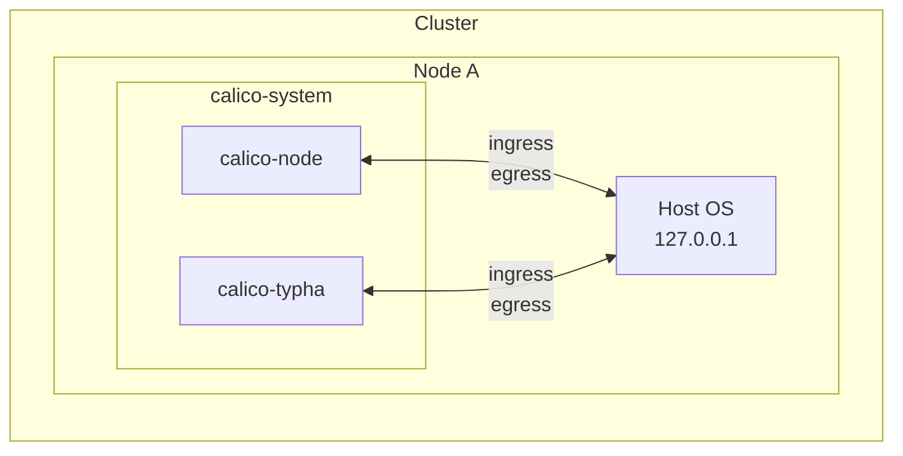
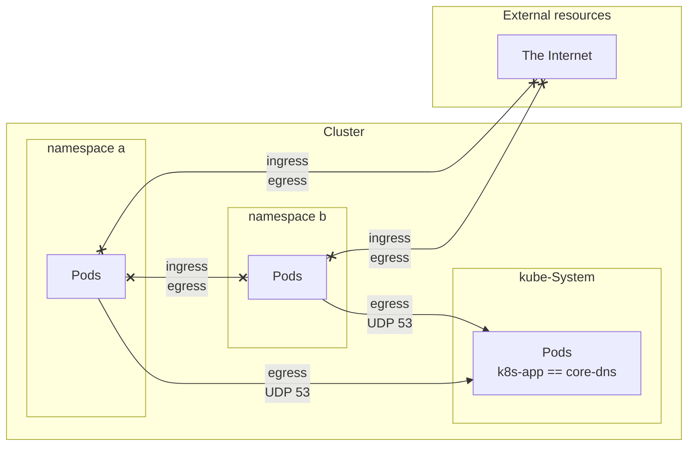
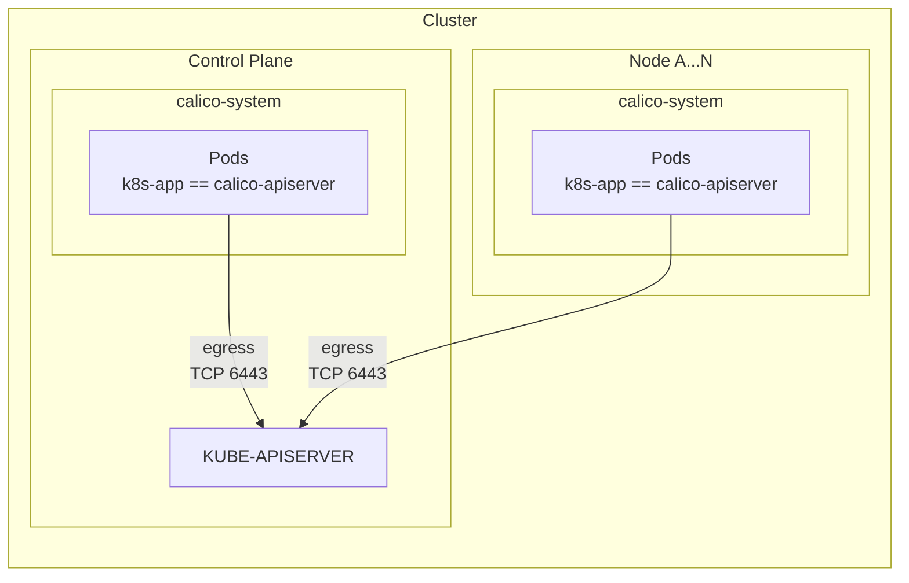
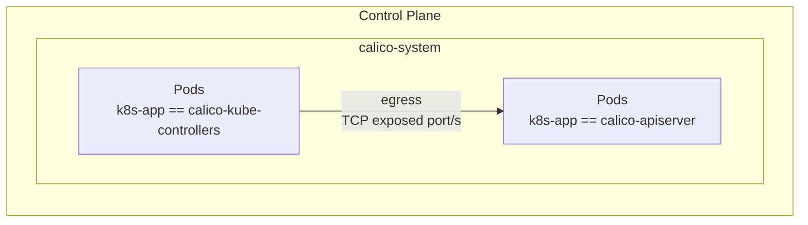
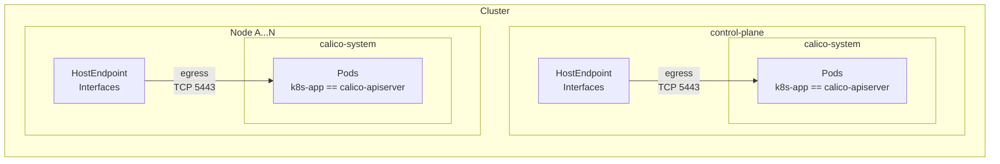
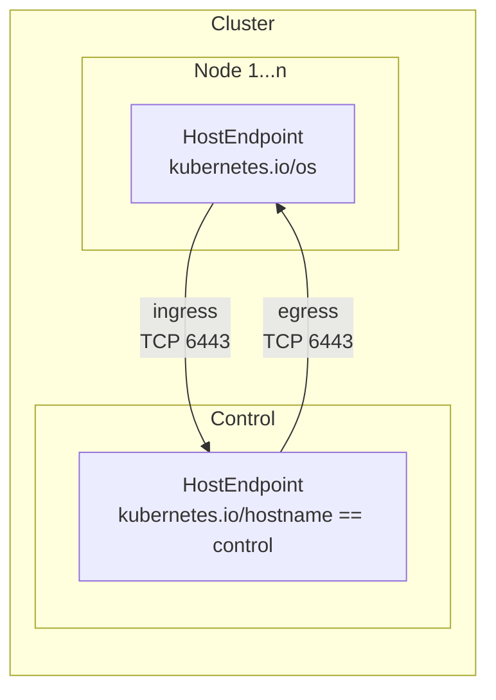
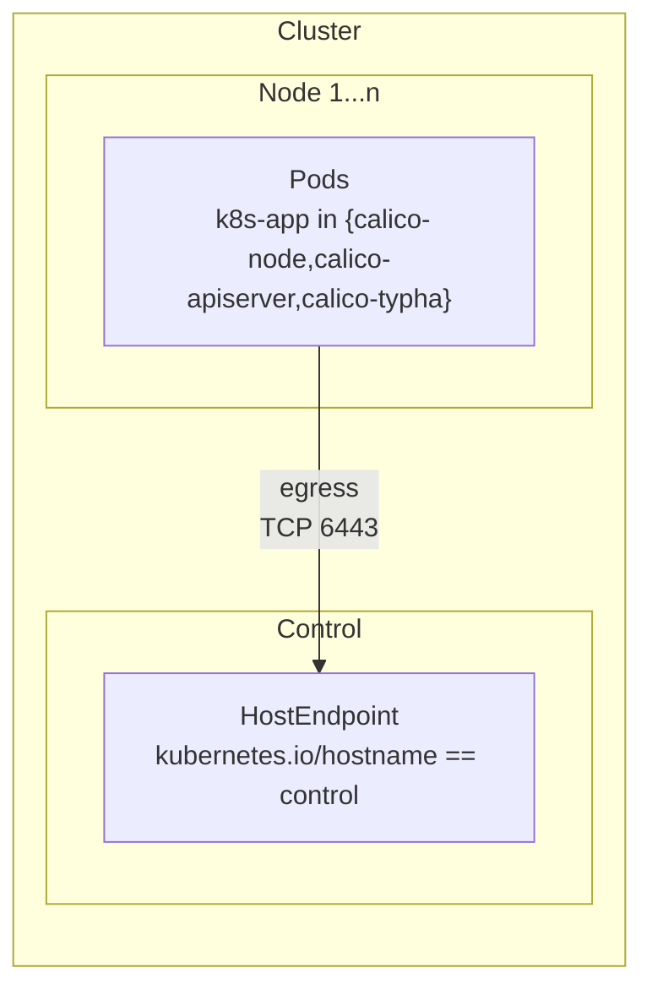
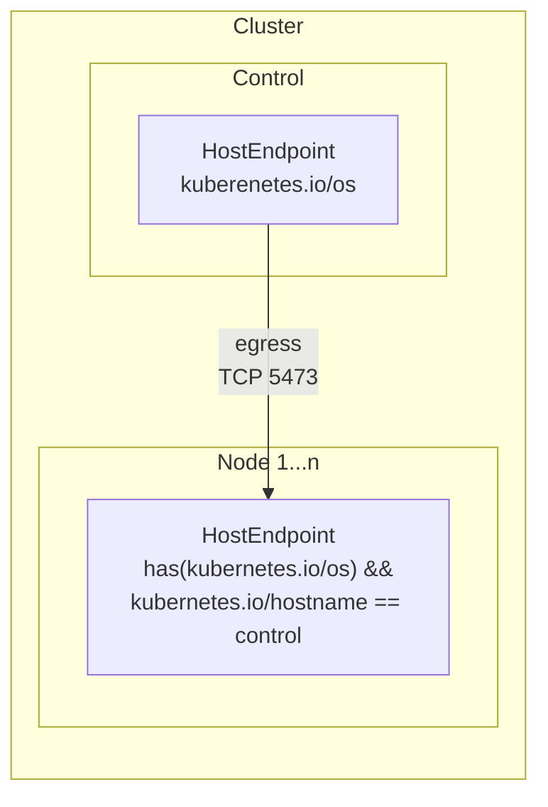
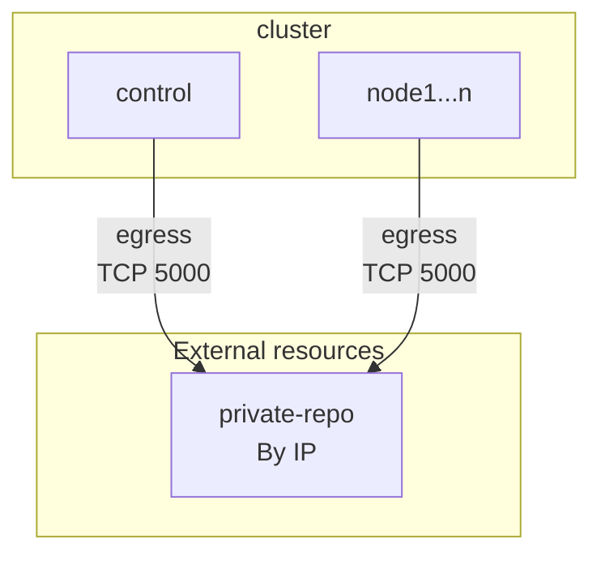

Policy design
===

Use the following command to explicitly allow every traffic in and out of your cluster:
```
kubectl create -f https://raw.githubusercontent.com/frozenprocess/Tigera-Presentations/conf42/2023-03-30.container-and-Kubernetes-security-policy-design/04.best-practices-for-securing-a-Kubernetes-environment/00.allow-everything.yaml
```



Use the following command to allow containers communicating with the localhost:
```
kubectl create -f https://raw.githubusercontent.com/frozenprocess/Tigera-Presentations/conf42/2023-03-30.container-and-Kubernetes-security-policy-design/04.best-practices-for-securing-a-Kubernetes-environment/01.container-to-localhost.yaml
```



Use the following command to restrict namespaced resources from reaching internet:
```
kubectl create -f https://raw.githubusercontent.com/frozenprocess/Tigera-Presentations/conf42/2023-03-30.container-and-Kubernetes-security-policy-design/04.best-practices-for-securing-a-Kubernetes-environment/02.deny-app-policy.yaml
```



Calico API server talks to the Kubernetes API server since api server is protected by hostendpoint policies global() is required
```
kubectl create -f https://raw.githubusercontent.com/frozenprocess/Tigera-Presentations/conf42/2023-03-30.container-and-Kubernetes-security-policy-design/04.best-practices-for-securing-a-Kubernetes-environment/03.calico-api-to-kapi.yaml
```



calico-Kubernetes-controller connects to api-server on port 5443
```
kubectl create -f https://raw.githubusercontent.com/frozenprocess/Tigera-Presentations/conf42/2023-03-30.container-and-Kubernetes-security-policy-design/04.best-practices-for-securing-a-Kubernetes-environment/04.calico-kube-controller-to-api.yaml
```



```
kubectl create -f https://raw.githubusercontent.com/frozenprocess/Tigera-Presentations/conf42/2023-03-30.container-and-Kubernetes-security-policy-design/04.best-practices-for-securing-a-Kubernetes-environment/05.calico-components-to-apiserver.yaml
```



Workers communication to Control PLane and Kubernetes API server
```
kubectl create -f https://raw.githubusercontent.com/frozenprocess/Tigera-Presentations/conf42/2023-03-30.container-and-Kubernetes-security-policy-design/04.best-practices-for-securing-a-Kubernetes-environment/06.worker-nodes-to-kapi.yaml
```



targeting srcnat traffic
```
kubectl create -f https://raw.githubusercontent.com/frozenprocess/Tigera-Presentations/conf42/2023-03-30.container-and-Kubernetes-security-policy-design/04.best-practices-for-securing-a-Kubernetes-environment/07.srcnated-to-kapi.yaml
```



Calico typha rules
```
kubectl create -f https://raw.githubusercontent.com/frozenprocess/Tigera-Presentations/conf42/2023-03-30.container-and-Kubernetes-security-policy-design/04.best-practices-for-securing-a-Kubernetes-environment/08.worker-nodes-to-typha.yaml
```


Private registry
===



```
apiVersion: projectcalico.org/v3
kind: GlobalNetworkPolicy
metadata:
  name: private-registry-policy
spec:
  order: 1001
  egress:
  - action: Allow
    protocol: TCP
    destination:
      nets:
      - $REGISTRY_IP/32
      ports:
      - 5000
```

Enabling HostEndpoint
===

```bash
kubectl patch kubecontrollersconfiguration default --type=merge --patch='{"spec": {"controllers": {"node": {"hostEndpoint": {"autoCreate": "Enabled"}}}}}'
```

```powershell
kubectl patch kubecontrollersconfiguration default --type=merge --patch='{\"spec\": {\"controllers\": {\"node\": {\"hostEndpoint\": {\"autoCreate\": \"Enabled\"}}}}}'
```

Default deny
===

```
kubectl delete -f https://raw.githubusercontent.com/frozenprocess/Tigera-Presentations/conf42/2023-03-30.container-and-Kubernetes-security-policy-design/04.best-practices-for-securing-a-Kubernetes-environment/00.allow-everything.yaml
```

Next step
===
In the next tutorial we are going to briefly look at [monitoring](../05.monitoring/readme.md).
